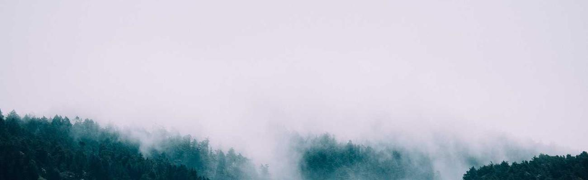

  

    
    

      Smoky Mountain Jazz Jam
    

    

      Next Jam Session 
      To Be Announced 
      Time of jam here
    

  

 
 

  <h1><strong>About The Smoky Mountain Jazz Jam</strong></h1>

  <ul class="larger-text">
    <li>The Smoky Mountain Jazz Jam is a new monthly jazz jam session being held at the Folkmoot Center of the Arts in Waynesville, NC.</li>
    <li>The jam focuses primarily on playing songs from the Great American Songbook and by great jazz composers.</li>
    <li>A partial list of songs that will be played at each monthly jam session will be posted in advance and can be found here: <a href="jam_tunes">Jam Session Song List</a></li>
    <li>Some frequently asked questions are addressed here: <a href="faq">FAQ</a></li>
  </ul>

  <h2><strong>Where</strong></h2>

  <ul class="larger-text">
    <li><a href="https://www.folkmoot.org/">Folkmoot Center for the Arts</a> in Waynesville, NC</li>
    <li>Address: <a href="https://maps.app.goo.gl/KduAxvnix88e4M369">Building B, 1122 Virginia Avenue, Waynesville, NC</a></li>
    <li>The jam will take place in the Folkmoot auditorium.</li>
  </ul>

  <h2><strong>When</strong></h2>

  <ul class="larger-text">
    <li>Jam sessions will be held on the ... (recurring day of month/week)</li>
    <li>The next jam session will be announced soon.</li>
  </ul>

  <h2><strong>Contact</strong></h2>
  <ul class="larger-text">
    <li>smokyjazzjam@gmail.com</li>
  </ul>

