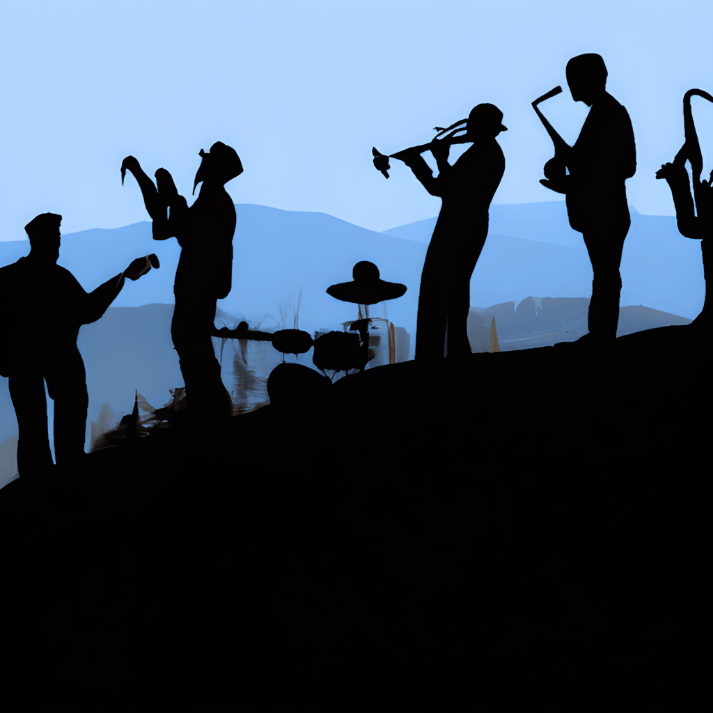

  
  
  **About The Smoky Mountain Jazz Jam**
   
  - The Smoky Mountain Jazz Jam is a new monthly jazz jam session held at [Folkmoot](https://www.folkmoot.org/) in Waynesville, NC.
    - Google Map with Folkmoot location [here](https://maps.app.goo.gl/KduAxvnix88e4M369) 
  - The Smoky Mountain jazz jam aims to provide a regular gathering place for jazz musicians in the far west counties of North Carolina to play. 
  - The jam focuses primarily on playing jazz repertoire from the Great American Songbook and from jazz composers.
   - A partial list of tunes that will be played at each monthly jam session can be found here: [Jam Session Tunes](jam_tunes)
   
  contact: smokyjazzjam@gmail.com
